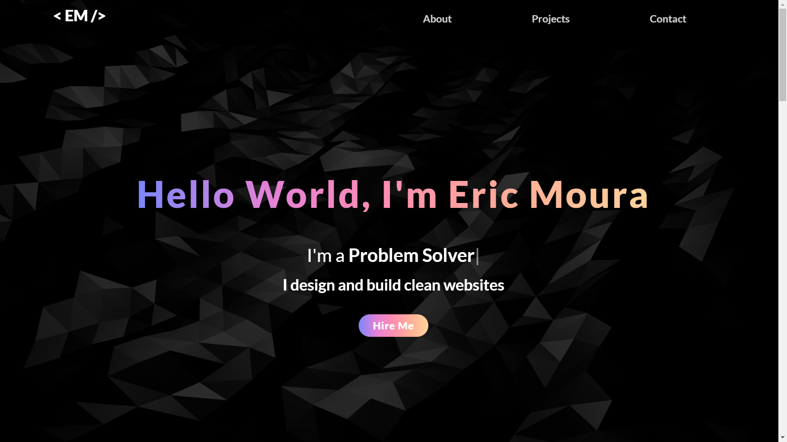
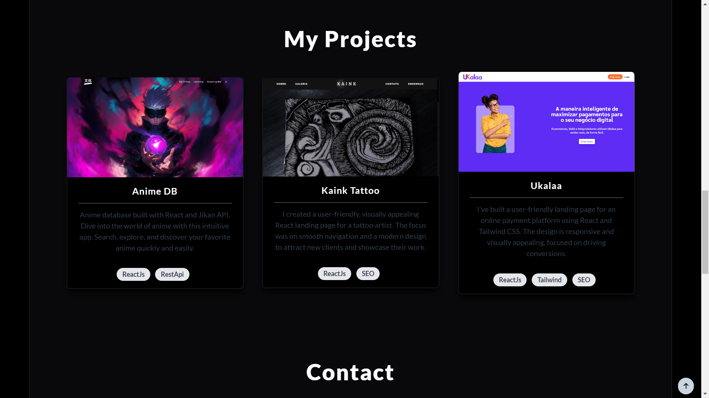
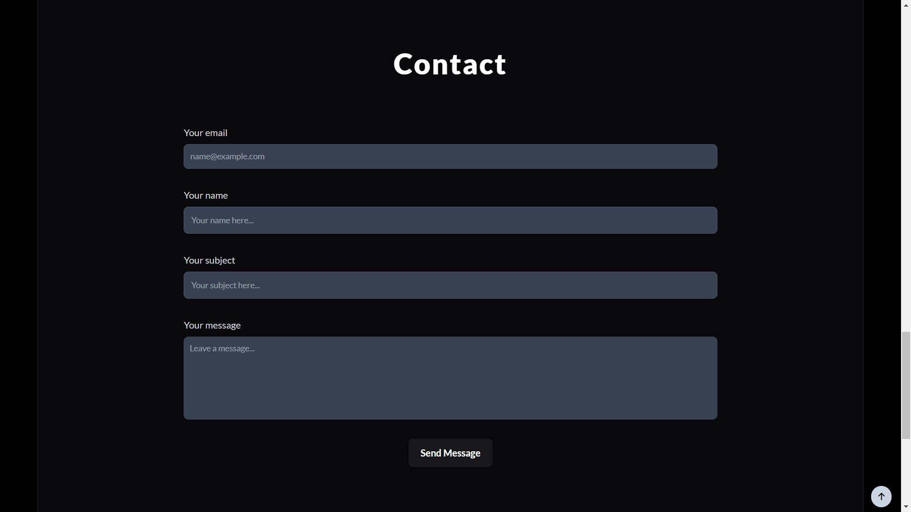

## Portfolio 2.0

Este projeto é um aprimoramento do meu antigo portfólio com design mais bonito e profissional e tecnologias mais modernas.

## 📂 Estrutura do Projeto:

- `index.html` 🌐: Página principal da aplicação
- `index.js` 💻: Arquivo JavaScript responsável pela lógica e interatividade da página, como animações ou efeitos visuais.
- `thanks.html` 🙏: Uma segunda página HTML, utilizada ao mandar uma mensagem através do formulário de contato
- `Readme.md` 📄: Este arquivo, descrevendo o projeto.
- `Images/` 🖼️: Pasta contendo as imagens utilizadas na página.

## 📷 Screenshots:

## Funcionalidades Adicionais:

- **Animações:** Animações utilizando frameworks em JavaScript.
- **Responsividade:** Página responsiva e totalmente mobile friendly
